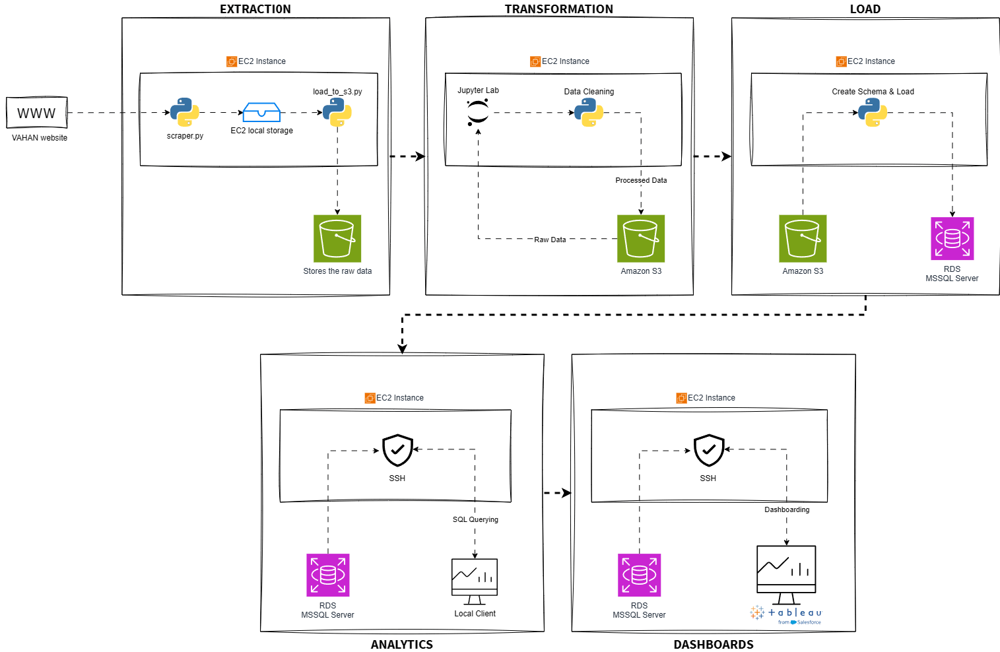

# 🚗⚡ Tracking India's EV Adoption

I built a full data pipeline — from raw government data to an interactive dashboard — to answer a real business question: *where and how fast is India's EV market actually growing?* This project demonstrates the full analytics lifecycle: problem framing, data sourcing, engineering, modelling, and stakeholder-ready visualization.

---

## 1. The Business Question

Before delving into this, I started where any analytics project should start — with the questions a business stakeholder would actually ask:

- Is India's EV adoption growing uniformly, or are certain **states** pulling ahead?
- Which **vehicle categories** (2-wheelers, 3-wheelers, cars, commercial fleets) are leading the EV transition?
- Does EV adoption track with economic indicators like **population**, or with infrastructure like **charging station availability**?
- Have **policy interventions** (subsidies, state EV policies) produced measurable spikes in adoption?

These questions shaped every downstream decision — what data to collect, how to structure the database, and what the final dashboard needed to answer at a glance

---

## 2. Finding the Data
India's Ministry of Road Transport & Highways publishes vehicle registration data through the **[VAHAN Dashboard](https://vahan.parivahan.gov.in)** — the only public source detailed enough to break registrations down by state, RTO, vehicle class, fuel type, and month.

The catch: **there is no API and no bulk export.** The dashboard is a dynamic, JavaScript-driven UI that only responds to interactive dropdown selections. Getting usable data out of it required reverse-engineering how the page communicates with its backend — not just scraping HTML. Of course I had to take help of Claude and make it understand how the page is structured and how the dynamic dropdowns worked.

To answer the population, and infrastructure questions above, I also sourced and integrated supporting datasets:
- State **population** estimates ( as per *[REPORT OF THE TECHNICAL GROUP ON POPULATION PROJECTIONS](https://nhm.gov.in/New_Updates_2018/Report_Population_Projection_2019.pdf)* by *[NATIONAL COMMISSION ON POPULATION MINISTRY OF HEALTH & FAMILY WELFARE](https://nhm.gov.in/)*)
- **EV charging station** density snapshots ()
- **Policy event** timelines (state EV subsidy announcements)

---

## 3. The Approach

With the business questions and data source identified, I designed a pipeline to move from raw, hard-to-access government data to something a decision-maker could actually explore:

  

