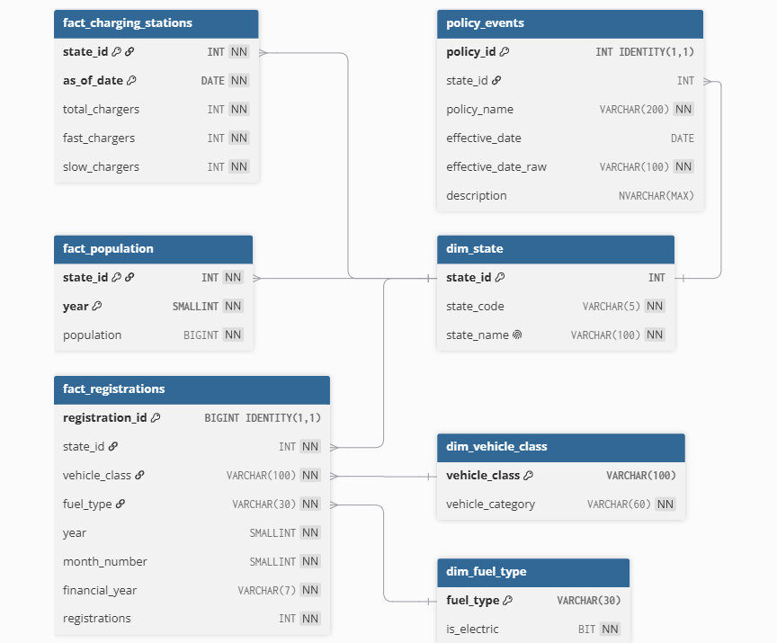

# 🚗⚡ Tracking India's EV Adoption

I built a full data pipeline — from raw government data to an interactive dashboard — to answer a real business question: *where and how fast is India's EV market actually growing?* This project demonstrates the full analytics lifecycle: problem framing, data sourcing, engineering, modelling, and stakeholder-ready visualization.

Tableau Dashboard - [Vehicle Registrations Analytics (VAHAN)](https://public.tableau.com/app/profile/maheshbdmi/viz/VehicleRegistrationsAnalyticsVAHAN/Summary)

[Observations/Recommendations](README_results.md)

---

## 1. The Business Question

Before delving into this, I started where any analytics project should start — with the questions a business stakeholder would actually ask:

- Is India's EV adoption growing uniformly, or are certain **states** pulling ahead?
- Which **vehicle categories** (2-wheelers, 3-wheelers, cars, commercial fleets) are leading the EV transition?
- Does EV adoption track with economic indicators like **population**, or with infrastructure like **charging station availability**?
- Have **policy interventions** (subsidies, state EV policies) produced measurable spikes in adoption?

These questions shaped every downstream decision — what data to collect, how to structure the database, and what the final dashboard needed to answer at a glance

---

## 2. Finding the Data
India's Ministry of Road Transport & Highways publishes vehicle registration data through the **[VAHAN Dashboard](https://vahan.parivahan.gov.in)** — the only public source detailed enough to break registrations down by state, RTO, vehicle class, fuel type, and month.

The catch: **there is no API and no bulk export.** The dashboard is a dynamic, JavaScript-driven UI that only responds to interactive dropdown selections. Getting usable data out of it required reverse-engineering how the page communicates with its backend — not just scraping HTML. Of course I had to take help of Claude and make it understand how the page is structured and how the dynamic dropdowns worked.

To answer the population, and infrastructure questions above, I also sourced and integrated supporting datasets:
- State **population** estimates ( as per *[REPORT OF THE TECHNICAL GROUP ON POPULATION PROJECTIONS](https://nhm.gov.in/New_Updates_2018/Report_Population_Projection_2019.pdf)* by *[NATIONAL COMMISSION ON POPULATION MINISTRY OF HEALTH & FAMILY WELFARE](https://nhm.gov.in/)*)
- **EV charging station** density snapshots ()
- **Policy event** timelines (state EV subsidy announcements)

---

## 3. The Approach

With the business questions and data source identified, I designed a pipeline to move from raw, hard-to-access government data to something a decision-maker could actually explore:

  

**Why this architecture?**
- **Scraping on EC2, not locally** — the extraction needed to run reliably and repeatedly across hundreds of state/vehicle-class/year/fuel-type combinations without tying up a personal machine.
- **S3 as a staging layer** — separates raw extraction from cleaned, analysis-ready data, and makes the pipeline reproducible.
- **A star schema in SQL Server**, rather than flat files — because the business questions above all involve *slicing* data (by state, by category, by fuel type, by time) and joining against context tables (population, infrastructure). A proper dimensional model makes that fast and reliable rather than re-deriving joins in every notebook.
- **Tableau as the final layer** — because the end consumer of this analysis is a stakeholder. The dashboard needed to let someone explore fuel-type market share by state and vehicle category without touching code.

---

  

## 4. What I Built

| Stage | What it does |
|---|---|
| **Scraper** (`scraper.py`, `batch_aws.py`) | Simulates the VAHAN dashboard's AJAX calls to extract registration counts by state, vehicle class, fuel type, month, and year (Credits to Claude) |
| **Storage** (S3) | Holds raw scrape output plus supporting reference data (population, charging stations) and cleaned outputs |
| **Database** (SQL Server on AWS RDS) | Star schema with dimension tables (State, RTO, Vehicle Class, Fuel Type, Time) and fact tables (Registrations, Population, GSDP, Charging Stations, Policy Events) |
| **Analysis** (Jupyter/pandas) | Cleaning, exploratory analysis, YoY growth trends, and correlation analysis against population/infrastructure/policy |
| **Dashboard** (Tableau) | Interactive view of EV market share by state, vehicle category, and fuel type over time |

## 🧰 Tech Stack

| Layer | Tools |
|---|---|
| **Scraping** | Python, `requests` (PrimeFaces AJAX/xhtml protocol simulation) |
| **Compute** | AWS EC2 (Amazon Linux 2023, t3.micro) |
| **Storage** | AWS S3 (raw + processed data) |
| **Database** | AWS RDS — SQL Server Express, T-SQL, `pyodbc` (ODBC Driver 18) |
| **Analysis** | Python (pandas), Jupyter Notebooks |
| **Visualization** | Tableau |

## 🔄 Pipeline Details

### a) Scraping (`scraper.py`, `batch_aws.py`)
The VAHAN dashboard is built on PrimeFaces, which drives its dropdowns and tables via AJAX calls rather than standard page loads. `scraper.py` reverse-engineers this to programmatically:
- Select **Y-Axis** and **X-Axis** dimensions (e.g., State, RTO, Vehicle Class, Fuel Type)
- Iterate across **month**, **year**, and **fuel type** filters
- Handle CLI arguments: `--yaxis`, `--xaxis`, `--month`, `--fuel`, `--year`

`batch_aws.py` orchestrates large-scale runs across the full combination space (state × RTO × vehicle class × month × year) on an EC2 instance, with resumability so long-running jobs can survive interruptions.

**Key engineering detail:** Y-Axis must be selected via AJAX *before* validating `--xaxis`, since the available X-Axis options are dynamically refreshed based on the Y-Axis selection — a quirk of how PrimeFaces re-renders the form.

### b) Storage (S3)
- Raw scraped output → S3 (partitioned by scrape run)
- Supporting reference data ( population, charging station snapshots, policy events) → `supporting_data/`
- Cleaned, analysis-ready outputs → `processed/`

### c) Database (SQL Server on RDS — `vahan-db`)
A **star schema** was designed to support flexible slicing of registrations by state, vehicle category, fuel type, and time:
- **Dimension tables:** State, RTO, Vehicle Class, Fuel Type, Time
- **Fact tables:** Registrations, Population, Charging Stations, Policy Events

Data is loaded via `pyodbc` (ODBC Driver 18). **Note:** SQL Server enforces a 2,100-parameter-per-statement limit, so bulk inserts use a conservative `chunksize` (~200 rows) to avoid hitting this cap.

### d) Analysis (Jupyter Notebooks)
- **Notebook 1 — Cleaning & EDA:** Deliberately kept simple and readable (optimized for interview walk-throughs over exhaustive exploration)
- **Notebook 2 — Deep Analysis:** Trend analysis, YoY growth, state-level EV penetration, correlation with population/charging infrastructure

### e) Visualization (Tableau)
Interactive dashboard showing **fuel type market share trends** by vehicle category and state, including:
- EV share of total registrations over time
- State-level comparisons
- Category-level breakdowns (2W / 3W / 4W / Commercial, etc.)

---

## 5. Key Decisions & Problem-Solving

Real-world data work rarely goes as planned. A few examples of judgment calls made along the way:

- **The dashboard's dropdowns are interdependent.** The available "X-Axis" options only populate correctly *after* the "Y-Axis" is selected — a quirk of the underlying framework. Solved by sequencing the AJAX calls to match the UI's actual behaviour rather than assuming static options
- **Tableau's FIXED calculations were ignoring filters by design.** To get accurate market-share percentages that still respected state and vehicle-category filters, the right fix was promoting those filters to *context filters* — a deliberate modelling choice, not a Tableau bug. Finally, I removed the FIXED calculations and gave each chart it's own sheet and built the them independently
- **Apparent data discrepancies between scrape runs turned out to be real** — the government source updates its own historical figures over time, which required distinguishing genuine pipeline errors from legitimate source-data changes

---

## 6. Skills This Project Demonstrates

- **Business framing:** translating an open-ended question ("how's the EV market doing?") into concrete, measurable data requirements
- **Data sourcing & extraction:** working with undocumented, dynamic web sources when no API exists
- **Cloud infrastructure:** AWS EC2, S3, and RDS used together as a small but complete pipeline
- **Data modelling:** dimensional (star schema) design for analytical querying
- **Data cleaning & analysis:** Python/pandas for EDA and trend analysis
- **Business intelligence:** Tableau dashboard design, including advanced calculation logic (LOD expressions, context filters)
- **Debugging & engineering judgment:** diagnosing subtle bugs (resume logic, filter order, dynamic form dependencies) rather than working around symptoms

---

## 7. Status & Next Steps

The pipeline is fully built end-to-end and the Tableau dashboard is complete.
- Adding automated data-quality checks post-scrape
- Extending the policy-event timeline for causal analysis of adoption spikes around subsidy announcements

---

## 📬 Contact

Built by **Mahesh**. Happy to walk through any part of this pipeline.

*Data sourced from the public [VAHAN Dashboard](https://vahan.parivahan.gov.in), Ministry of Road Transport & Highways, Government of India. This project is for educational/portfolio purposes and is not affiliated with the Government of India.*
